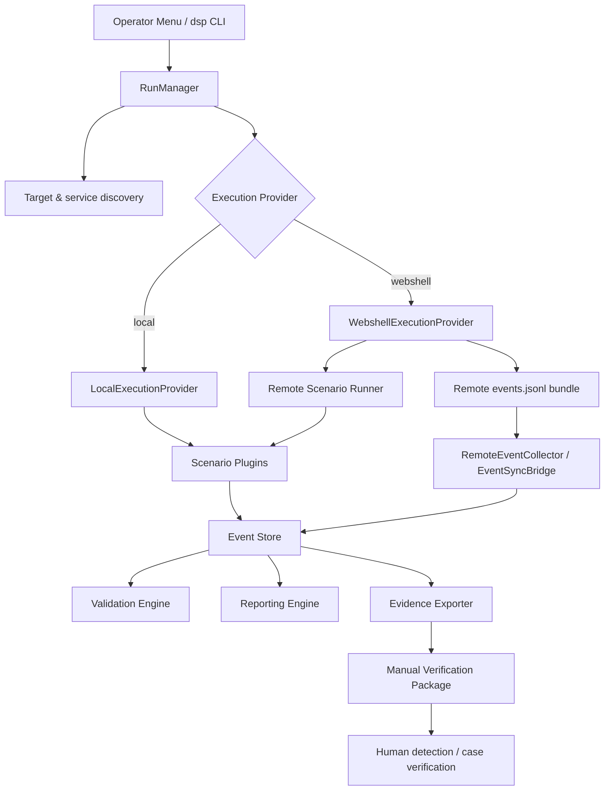

# Architecture

DSP separates **activity generation**, **event recording**, **validation/reporting**, and **security-platform confirmation** so a customer POC can preserve a clear evidence boundary.

## High-level flow



## Operator layer

The user-facing product has two interfaces:

- `dsp-menu.sh` — SSH-friendly operator menu using `whiptail` when available
- `dsp` — primary CLI for advanced or automated operation

The menu intentionally reduces the normal workflow to target network, execution mode, and coverage profile.

## RunManager

`RunManager` orchestrates the run lifecycle. The CLI resolves a profile or explicit scenario list, validates target scope, selects an execution provider, streams progress, and delegates scenario execution to the manager.

## Operational profiles

Current profile-driven runs use this ordered scenario plan:

```text
host_behavior_check
port_sweep
http_followup
sql_injection
ssh_failure
ldap_enumeration
smb_login_failure
kerberos_failure
dga
rare_protocol_activity
dns_tunnel
```

The runtime filters that list against active plugins.

## Scenario plugin model

Scenario code is isolated under `scenarios/<id>/`, typically with a manifest and Python implementation. The plugin loader discovers scenarios and exposes active IDs to the run planner.

This allows scenario coverage to grow without turning the operator interface into a large collection of low-level switches.

## Local provider

Local execution runs scenario code from the DSP host and writes structured events directly into the local run pipeline.

## Webshell provider

The webshell provider dispatches execution to an authorized remote host. The remote side creates an `events.jsonl` bundle, which is retrieved and imported into the local Event Store.

The release-validated remote paths are JSP/Tomcat and PHP/Apache. ASPX/IIS remains preview.

## Event Store as source of truth

The Release 1.0 architecture uses SQLite `events.db` as the append-only source of truth for a run. Portable JSONL is used for export and remote event transfer.

The Event Store feeds:

- validation
- reporting
- evidence export
- manual verification packages

This avoids coupling report generation directly to scenario stdout.

## Evidence and detection boundary

DSP's core pipeline ends with evidence that a human or optional adapter can compare with the security platform.

```text
S2: DSP execution/event validation
      ↓
S3: Optional detection confirmation
      ↓
Human review / customer POC conclusion
```

S3 is optional and does not alter the S2 exit code or `ValidationResult`.

## Optional detection confirmation

The CLI currently exposes `--confirm-detection` with three Stellar client modes:

- `manual` — generate evidence templates without an API
- `mock` — deterministic local responses for CI/demo
- `http` — experimental live Stellar HTTP client

Normal DSP operation does not require a Stellar API token.

## Important design boundary

DSP is a **Detection Scenario Platform**, not an automated compromise verifier. The architecture intentionally avoids deriving `attack_success`, vendor alert truth, or XDR case success from traffic generation alone.
