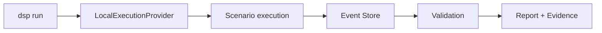
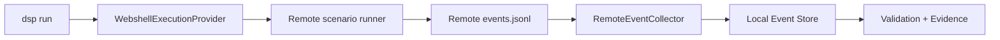

# Execution Modes

DSP supports two execution providers: **local** and **webshell**.

## Local execution

Use local mode when the DSP host itself can reach the authorized target network.

```bash
dsp run --profile normal --target-net 10.10.10.0/24
```

Local execution flows through `LocalExecutionProvider` and the standard `RunManager`, then writes events, validation results, reports, and evidence packages to the local run directory.



## Webshell execution

Use webshell mode when the POC requires activity to originate from an authorized remote host inside the target environment.

```bash
dsp run \
  --profile normal \
  --target-net 10.10.10.0/24 \
  --execution-provider webshell \
  --webshell-family jsp \
  --webshell-url http://10.10.10.50:8080/shell.jsp \
  --remote-work-dir /tmp/dsp
```

DSP dispatches scenario execution to the remote host, retrieves the resulting `events.jsonl` bundle, imports those events into the local Event Store, and continues through the same validation/report/evidence pipeline.



## Webshell family status

| Family | Typical platform | Status | Notes |
| --- | --- | --- | --- |
| JSP | Java / Tomcat | **Validated** | Real Tomcat validation completed; 10/10 release scenarios documented |
| PHP | Apache / PHP | **Validated** | Real Apache/PHP validation completed; 10/10 release scenarios documented |
| ASPX | Windows / IIS | **Preview** | HTTP contract exists, but real Windows IIS execution is not yet validated |

<Warning>
Do not describe ASPX as production-ready. The current release documentation explicitly lists the Windows/IIS webshell path as unvalidated and Linux-oriented bundle handling as a known limitation.
</Warning>

## Webshell configuration

The three main fields are:

- **Family** — `jsp`, `php`, or `aspx`
- **URL** — full HTTP(S) path to the authorized endpoint
- **Remote work directory** — writable location used for remote scripts and event bundles

Examples:

```text
http://10.10.10.50:8080/shell.jsp
http://10.10.10.50/shell.php
https://lab.example/path/shell.aspx
```

The URL extension should match the selected family.

### TLS verification

The CLI supports:

```bash
--verify-tls
```

Use it when the webshell endpoint is HTTPS and certificate verification should be enforced.

## Fake JSP lab

The source repository includes `scripts/setup_fake_shelljsp_lab.sh` for a quick isolated smoke test. It creates a small Flask endpoint that mimics the command interface used by a JSP webshell.

<Warning>
The fake shell endpoint can execute arbitrary shell commands. Use it only on an isolated test system and never expose it to the public Internet.
</Warning>

For production-like remote validation, use a properly controlled JSP/Tomcat or PHP/Apache test environment rather than the fake lab endpoint.
