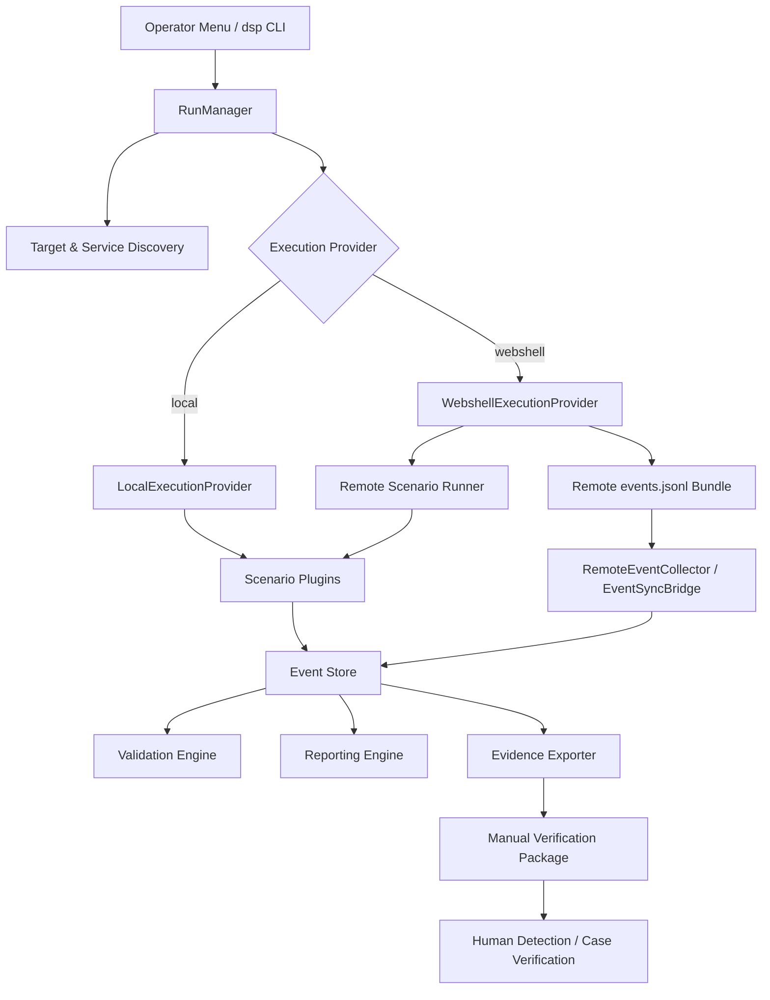

# Architecture

DSP는 고객 POC에서 Evidence Boundary를 명확하게 유지할 수 있도록 **Activity Generation**, **Event Recording**, **Validation/Reporting**, **Security-platform Confirmation**을 분리합니다.

## 전체 흐름



## Operator Layer

사용자에게 제공되는 Interface는 두 가지입니다.

- `dsp-menu.sh` — 가능한 경우 `whiptail`을 사용하는 SSH-friendly Operator Menu
- `dsp` — Advanced 또는 Automated Operation을 위한 기본 CLI

Menu는 일반적인 Workflow를 Target Network, Execution Mode 및 Coverage Profile 선택으로 단순화합니다.

## RunManager

`RunManager`는 Run Lifecycle을 Orchestration합니다. CLI가 Profile 또는 Explicit Scenario List를 결정하고 Target Scope를 검증하며 Execution Provider를 선택하고 Progress를 출력한 뒤 실제 Scenario Execution을 Manager에 전달합니다.

## Operational Profile

현재 Profile 기반 Run은 다음 순서의 Scenario Plan을 사용합니다.

```text
host_behavior_check
port_sweep
http_followup
sql_injection
ssh_failure
ldap_enumeration
smb_login_failure
kerberos_failure
dga
rare_protocol_activity
dns_tunnel
```

Runtime은 이 목록을 Active Plugin과 비교하여 실제 실행 가능한 Scenario만 사용합니다.

## Scenario Plugin Model

Scenario Code는 일반적으로 Manifest와 Python Implementation을 포함하는 `scenarios/<id>/` 아래에 분리되어 있습니다. Plugin Loader가 Scenario를 발견하고 Run Planner에 Active ID를 제공합니다.

이 구조를 사용하면 Operator Interface를 수많은 Low-level Switch로 복잡하게 만들지 않고도 Scenario Coverage를 확장할 수 있습니다.

## Local Provider

Local Execution은 DSP Host에서 Scenario Code를 실행하고 구조화된 Event를 Local Run Pipeline에 직접 기록합니다.

## Webshell Provider

Webshell Provider는 승인된 Remote Host로 Execution을 전달합니다. Remote Side에서 `events.jsonl` Bundle을 생성하고 DSP가 이를 가져와 Local Event Store에 Import합니다.

Release에서 실제 검증된 Remote Path는 JSP/Tomcat과 PHP/Apache입니다. ASPX/IIS는 Preview 상태입니다.

## Source of Truth로서의 Event Store

Release 1.0 Architecture는 SQLite `events.db`를 Run의 Append-only Source of Truth로 사용합니다. Portable JSONL은 Export 및 Remote Event Transfer에 사용됩니다.

Event Store의 Data는 다음 기능에서 사용됩니다.

- Validation
- Reporting
- Evidence Export
- Manual Verification Package

이를 통해 Report Generation이 Scenario stdout에 직접 의존하지 않도록 합니다.

## Evidence와 Detection의 경계

DSP Core Pipeline은 사람 또는 선택적인 Adapter가 보안 플랫폼의 결과와 비교할 수 있는 Evidence를 생성하는 지점까지 담당합니다.

```text
S2: DSP Execution/Event Validation
      ↓
S3: Optional Detection Confirmation
      ↓
Human Review / Customer POC Conclusion
```

S3는 선택 사항이며 S2 Exit Code 또는 `ValidationResult`를 변경하지 않습니다.

## 선택적인 Detection Confirmation

현재 CLI는 `--confirm-detection`과 세 가지 Stellar Client Mode를 제공합니다.

- `manual` — API 없이 Evidence Template 생성
- `mock` — CI/Demo를 위한 Deterministic Local Response
- `http` — Experimental Live Stellar HTTP Client

일반적인 DSP 운영에는 Stellar API Token이 필요하지 않습니다.

## 중요한 설계 경계

DSP는 **Detection Scenario Platform**이며 Automated Compromise Verifier가 아닙니다. Architecture는 Traffic Generation만으로 `attack_success`, Vendor Alert의 성공 여부 또는 XDR Case 성공을 추론하지 않도록 의도적으로 설계되어 있습니다.
