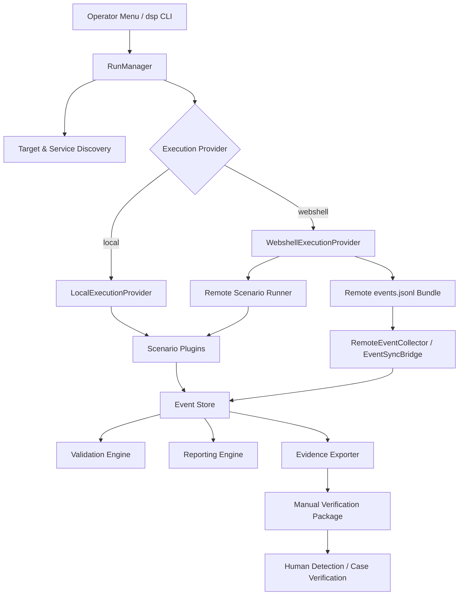

# Architecture

DSP는 고객 POC에서 무엇을 실행했고 무엇을 보안 플랫폼에서 확인했는지 구분할 수 있도록 **활동 생성**, **이벤트 기록**, **검증/보고**, **보안 플랫폼 확인** 단계를 나눕니다.

## 전체 흐름


```mermaid
flowchart TD
  O[Operator Menu / dsp CLI] --> RM[RunManager]
  RM --> D[Target & Service Discovery]
  RM --> P{Execution Provider}
  P -->|local| L[LocalExecutionProvider]
  P -->|webshell| W[WebshellExecutionProvider]
  L --> S[Scenario Plugins]
  W --> RS[Remote Scenario Runner]
  RS --> S
  S --> ES[Event Store]
  W --> RB[Remote events.jsonl Bundle]
  RB --> RC[RemoteEventCollector / EventSyncBridge]
  RC --> ES
  ES --> V[Validation Engine]
  ES --> R[Reporting Engine]
  ES --> E[Evidence Exporter]
  E --> M[Manual Verification Package]
  M --> H[Human Detection / Case Verification]
```

## Operator Layer

사용자에게 제공되는 Interface는 두 가지입니다.

- `dsp-menu.sh` — 가능한 경우 `whiptail`을 사용하는 SSH-friendly Operator Menu
- `dsp` — Advanced 또는 Automated Operation을 위한 기본 CLI

메뉴에서는 일반적인 작업을 대상 네트워크, 실행 방식, 실행 범위 프로필 세 가지 선택으로 단순화합니다.

## RunManager

`RunManager`는 실행 전체 과정을 조정합니다. CLI가 프로필 또는 명시적 시나리오 목록을 결정하고 대상 범위를 검증한 뒤 실행 Provider를 선택하고 진행 상황을 표시합니다.

## Operational Profile

현재 프로필 기반 실행은 다음 순서로 시나리오를 수행합니다.

```text
host_behavior_check
port_sweep
http_followup
sql_injection
ssh_failure
ldap_enumeration
smb_login_failure
kerberos_failure
dga
rare_protocol_activity
dns_tunnel
```

런타임은 이 목록을 활성 Plugin과 비교해 실제 실행 가능한 시나리오만 사용합니다.

## Scenario Plugin Model

Scenario Code는 일반적으로 Manifest와 Python Implementation을 포함하는 `scenarios/<id>/` 아래에 분리되어 있습니다. Plugin Loader가 Scenario를 발견하고 Run Planner에 Active ID를 제공합니다.

이 구조를 사용하면 운영 화면에 수많은 저수준 옵션을 추가하지 않고도 시나리오 범위를 확장할 수 있습니다.

## Local Provider

Local Execution은 DSP Host에서 Scenario Code를 실행하고 구조화된 Event를 Local Run Pipeline에 직접 기록합니다.

## Webshell Provider

Webshell Provider는 승인된 Remote Host로 Execution을 전달합니다. Remote Side에서 `events.jsonl` Bundle을 생성하고 DSP가 이를 가져와 Local Event Store에 Import합니다.

Release에서 실제 검증된 Remote Path는 JSP/Tomcat과 PHP/Apache입니다. ASPX/IIS는 Preview 상태입니다.

## 실행 기록의 기준이 되는 Event Store

Release 1.0에서는 SQLite `events.db`를 실행 기록의 기준으로 사용합니다. Portable JSONL은 내보내기와 원격 이벤트 전송에 사용됩니다.

Event Store의 Data는 다음 기능에서 사용됩니다.

- Validation
- Reporting
- Evidence Export
- Manual Verification Package

이를 통해 Report Generation이 Scenario stdout에 직접 의존하지 않도록 합니다.

## 실행 기록과 탐지 결과 구분

DSP의 기본 처리 범위는 보안 플랫폼의 결과와 비교할 수 있도록 실행 기록을 남기는 데까지입니다.

```text
S2: DSP Execution/Event Validation
      ↓
S3: Optional Detection Confirmation
      ↓
Human Review / Customer POC Conclusion
```

S3는 선택 사항이며 S2 Exit Code 또는 `ValidationResult`를 변경하지 않습니다.

## 선택적인 탐지 확인

현재 CLI는 `--confirm-detection`과 세 가지 Stellar Client Mode를 제공합니다.

- `manual` — API 없이 확인 템플릿 생성
- `mock` — CI/데모를 위한 고정된 로컬 응답
- `http` — Experimental Live Stellar HTTP Client

일반적인 DSP 운영에는 Stellar API Token이 필요하지 않습니다.

## 중요한 설계 경계

DSP는 **Detection Scenario Platform**이며 침해 여부를 자동 판정하는 도구가 아닙니다. Architecture는 Traffic Generation만으로 `attack_success`, Vendor Alert의 성공 여부 또는 XDR Case 성공을 추론하지 않도록 의도적으로 설계되어 있습니다.
