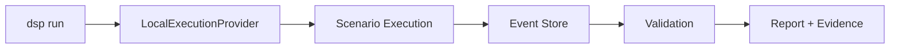
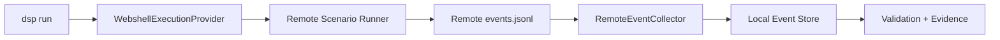

# 실행 모드

DSP는 **local**과 **webshell** 두 가지 Execution Provider를 지원합니다.

## Local 실행

DSP Host 자체에서 승인된 Target Network에 접근할 수 있을 때 Local Mode를 사용합니다.

```bash
dsp run --profile normal --target-net 10.10.10.0/24
```

Local Execution은 `LocalExecutionProvider`와 표준 `RunManager`를 통해 Scenario를 실행한 뒤 Event, Validation Result, Report 및 Evidence Package를 Local Run Directory에 기록합니다.



## Webshell 실행

POC Activity를 Target Environment 내부의 승인된 Remote Host에서 발생시켜야 할 때 Webshell Mode를 사용합니다.

```bash
dsp run \
  --profile normal \
  --target-net 10.10.10.0/24 \
  --execution-provider webshell \
  --webshell-family jsp \
  --webshell-url http://10.10.10.50:8080/shell.jsp \
  --remote-work-dir /tmp/dsp
```

DSP는 Scenario Execution을 Remote Host로 전달하고, 결과로 생성된 `events.jsonl` Bundle을 가져와 Local Event Store에 Import한 뒤 동일한 Validation/Report/Evidence Pipeline을 계속 수행합니다.



## Webshell Family 상태

| Family | 일반적인 Platform | 상태 | 설명 |
| --- | --- | --- | --- |
| JSP | Java / Tomcat | **Validated** | 실제 Tomcat 검증 완료, Release Scenario 10/10 문서화 |
| PHP | Apache / PHP | **Validated** | 실제 Apache/PHP 검증 완료, Release Scenario 10/10 문서화 |
| ASPX | Windows / IIS | **Preview** | HTTP Contract는 존재하지만 실제 Windows IIS 실행은 아직 검증되지 않음 |

<Warning>
ASPX를 Production-ready로 설명하지 마십시오. 현재 Release Documentation은 Windows/IIS Webshell Path를 아직 미검증 상태로 명시하며, Bundle Handling도 현재 검증된 경로에서는 Linux 중심입니다.
</Warning>

## Webshell 설정

주요 설정 항목은 세 가지입니다.

- **Family** — `jsp`, `php`, `aspx`
- **URL** — 승인된 Endpoint의 전체 HTTP(S) 경로
- **Remote work directory** — Remote Script와 Event Bundle을 저장할 수 있는 쓰기 가능한 위치

예시:

```text
http://10.10.10.50:8080/shell.jsp
http://10.10.10.50/shell.php
https://lab.example/path/shell.aspx
```

URL Extension은 선택한 Family와 일치해야 합니다.

### TLS Verification

CLI는 다음 옵션을 지원합니다.

```bash
--verify-tls
```

Webshell Endpoint가 HTTPS이고 Certificate Verification을 강제해야 할 때 사용합니다.

## Fake JSP Lab

Source Repository에는 빠른 격리 Smoke Test를 위한 `scripts/setup_fake_shelljsp_lab.sh`가 포함되어 있습니다. 이 Script는 JSP Webshell이 사용하는 Command Interface를 흉내 내는 작은 Flask Endpoint를 생성합니다.

<Warning>
Fake Shell Endpoint는 임의의 Shell Command를 실행할 수 있습니다. 반드시 격리된 Test System에서만 사용하고 Public Internet에 노출하지 마십시오.
</Warning>

Production에 가까운 Remote Validation을 수행하려면 Fake Lab 대신 적절히 통제된 JSP/Tomcat 또는 PHP/Apache Test Environment를 사용하십시오.
