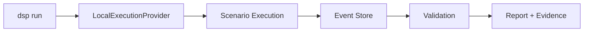
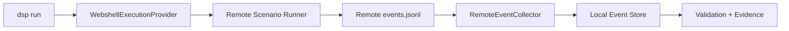

# 실행 모드

DSP는 **local**과 **webshell** 두 가지 실행 방식을 지원합니다.

## Local 실행

DSP 호스트에서 승인된 대상 네트워크에 직접 접근할 수 있을 때 local 모드를 사용합니다.

```bash
dsp run --profile normal --target-net 10.10.10.0/24
```

local 실행은 `LocalExecutionProvider`와 `RunManager`를 통해 시나리오를 실행한 뒤 이벤트, 검증 결과, 보고서와 확인 자료를 로컬 실행 디렉터리에 저장합니다.


```mermaid
flowchart LR
  CLI[dsp run] --> P[LocalExecutionProvider]
  P --> S[Scenario Execution]
  S --> E[Event Store]
  E --> V[Validation]
  V --> R[Report + Evidence]
```

## Webshell 실행

POC 활동을 대상 환경 내부의 승인된 원격 호스트에서 발생시켜야 할 때 Webshell 모드를 사용합니다.

```bash
dsp run \
  --profile normal \
  --target-net 10.10.10.0/24 \
  --execution-provider webshell \
  --webshell-family jsp \
  --webshell-url http://10.10.10.50:8080/shell.jsp \
  --remote-work-dir /tmp/dsp
```

DSP는 시나리오 실행을 원격 호스트로 전달하고, 생성된 `events.jsonl` 번들을 가져와 로컬 Event Store에 저장한 뒤 같은 검증 및 보고 절차를 계속 수행합니다.


```mermaid
flowchart LR
  CLI[dsp run] --> W[WebshellExecutionProvider]
  W --> RR[Remote Scenario Runner]
  RR --> B[Remote events.jsonl]
  B --> C[RemoteEventCollector]
  C --> E[Local Event Store]
  E --> V[Validation + Evidence]
```

## Webshell Family 상태

| 유형 | 일반적인 플랫폼 | 상태 | 설명 |
| --- | --- | --- | --- |
| JSP | Java / Tomcat | **검증 완료** | 실제 Tomcat 검증 완료, 릴리스 시나리오 10/10 검증 기록 |
| PHP | Apache / PHP | **검증 완료** | 실제 Apache/PHP 검증 완료, 릴리스 시나리오 10/10 검증 기록 |
| ASPX | Windows / IIS | **Preview** | HTTP Contract는 존재하지만 실제 Windows IIS 실행은 아직 검증되지 않음 |

<Warning>
ASPX를 운영 환경에서 검증 완료된 기능으로 설명하지 마십시오. 현재 릴리스 문서는 Windows/IIS Webshell 경로를 아직 미검증 상태로 명시하며, 번들 처리 역시 현재 검증된 경로에서는 Linux 중심입니다.
</Warning>

## Webshell 설정

주요 설정 항목은 세 가지입니다.

- **Family** — `jsp`, `php`, `aspx`
- **URL** — 승인된 엔드포인트의 전체 HTTP(S) 경로
- **Remote work directory** — Remote Script와 Event Bundle을 저장할 수 있는 쓰기 가능한 위치

예시:

```text
http://10.10.10.50:8080/shell.jsp
http://10.10.10.50/shell.php
https://lab.example/path/shell.aspx
```

URL Extension은 선택한 Family와 일치해야 합니다.

### TLS Verification

CLI는 다음 옵션을 지원합니다.

```bash
--verify-tls
```

Webshell Endpoint가 HTTPS이고 Certificate Verification을 강제해야 할 때 사용합니다.

## Fake JSP Lab

소스 저장소에는 빠른 격리 테스트를 위한 `scripts/setup_fake_shelljsp_lab.sh`가 포함되어 있습니다. 이 스크립트는 JSP Webshell이 사용하는 Command Interface를 흉내 내는 작은 Flask 엔드포인트를 생성합니다.

<Warning>
Fake Shell Endpoint는 임의의 Shell Command를 실행할 수 있습니다. 반드시 격리된 Test System에서만 사용하고 Public Internet에 노출하지 마십시오.
</Warning>

운영 환경에 가까운 원격 검증을 수행하려면 간이 테스트 환경 대신 적절히 통제된 JSP/Tomcat 또는 PHP/Apache 테스트 환경를 사용하십시오.
