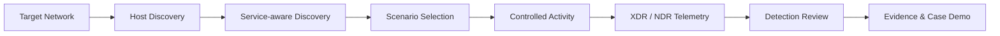

# 고객 POC 프로그램

DSP는 고객 POC에서 자주 발생하는 문제를 해결하기 위해 설계되었습니다. 고객 환경이 안전하거나 폐쇄되어 있거나 단순히 너무 조용해서 평가 기간 동안 의미 있는 Alert과 Case가 충분히 발생하지 않을 수 있습니다.

## POC에서의 문제

<CardGroup cols={2}>
  <Card title="깨끗한 네트워크에서 증거 부족" icon="shield">
    정상적인 고객 네트워크에서는 Detection 및 Investigation 가치를 보여줄 만큼 의미 있는 보안 이벤트가 충분히 발생하지 않을 수 있습니다.
  </Card>
  <Card title="고객 내부 보고 요구" icon="file-chart-column">
    보안팀은 POC 이후 내부 보고를 위해 Screenshot, Timeline, Evidence 및 Case가 필요한 경우가 많습니다.
  </Card>
  <Card title="Red-Team 형태의 요청" icon="crosshairs">
    고객은 파괴적인 도구를 사용하지 않으면서 관찰 가능한 Detection을 발생시키는 통제된 Activity를 요청할 수 있습니다.
  </Card>
  <Card title="일반적인 BAS와의 불일치" icon="puzzle-piece">
    범용 Attack Execution Tool은 특정 XDR/NDR POC에서 보여주려는 Detection 및 Workflow와 정확히 맞지 않을 수 있습니다.
  </Card>
</CardGroup>

목표는 또 하나의 공격 Framework를 만드는 것이 아닙니다. 목표는 **XDR/NDR의 가치를 눈에 보이게 하고, 반복 가능하게 만들며, 고객이 보고할 수 있도록 하는 것**입니다.

## 개념적인 POC 흐름

고객에게는 다음 7단계로 설명할 수 있습니다.

1. 허가된 Target Network를 정의합니다.
2. 접근 가능한 Host를 확인합니다.
3. DSP Runtime/Scenario 흐름을 통해 관련 Network Service를 확인합니다.
4. Operational Profile에서 Scenario를 자동 선택하거나 Advanced Test를 위해 직접 선택합니다.
5. Service에 맞는 관찰 가능한 Activity를 생성합니다.
6. 보안 플랫폼에서 결과 XDR/NDR Detection을 확인합니다.
7. Evidence를 수집하고, 가능한 경우 관련 Alert을 XDR Investigation Case로 보여줍니다.

<Note>
위 7단계는 **POC Workflow Model**입니다. 현재 구현은 각 단계를 별도의 사용자 명령으로 노출하지 않습니다. `dsp run`은 Target Expansion, Discovery/Prefetch, Scenario Ordering, Execution, Event Store 기록, Validation, Reporting 및 Evidence Generation을 하나의 Operational Flow로 수행합니다.
</Note>

## 엔지니어가 DSP를 사용하는 방법

일반적인 고객 POC에서 엔지니어는 보통 세 가지만 결정하면 됩니다.

| 결정 항목 | 옵션 |
| --- | --- |
| Activity를 어디에서 발생시킬 것인가? | `local` 또는 `webshell` |
| 어떤 Network를 대상으로 할 것인가? | `--target-net <CIDR>` |
| 대상 범위를 얼마나 넓게 할 것인가? | `normal` 또는 `high` |

현재 v1.4.0 Runtime에서 `normal`과 `high`는 **Coverage Profile**입니다. 두 Profile의 대상별 Activity Volume은 동일하며, `high`는 더 많은 발견된 대상에 동일한 Activity를 확장합니다.

## Webshell Mode가 유용한 경우

POC Activity를 고객 네트워크 **내부**의 사전에 승인된 Lab/Test Host에서 발생시켜야 할 때 Webshell Provider가 유용합니다. 이를 통해 Internal Scan, Service Discovery, DNS Activity, Web Request, Identity Service Failure 및 Host Behavior를 실제 고객 환경에 더 가까운 형태로 생성할 수 있습니다.

검증된 Remote Provider는 JSP와 PHP입니다. ASPX는 실제 Windows IIS Validation이 완료될 때까지 Preview 상태입니다.

## POC 성공 기준

좋은 POC 결과는 다음 세 가지 질문을 분리해서 확인해야 합니다.

| 계층 | 질문 | Evidence |
| --- | --- | --- |
| DSP Execution | DSP가 의도한 Activity를 실제로 생성했는가? | Event Store, Traffic Summary, Run Report |
| Detection | 보안 제품이 해당 Activity를 탐지했는가? | XDR/NDR UI의 Alert 또는 Detection |
| Investigation | 관련 Signal이 의미 있는 Case/Story로 연결되었는가? | Correlated Case, Timeline, Screenshot, Analyst Note |

이 계층을 분리하면 DSP 자체가 증명하는 범위를 과장하지 않을 수 있습니다.

<Card title="3rd-Party Alert & Case Demo 구성" icon="link" href="/ko/third-party-alert-case-demo">
  생성된 Activity를 이용해 External Alert, NDR Detection, EDR Alert 등 여러 Signal을 하나의 XDR Investigation Case로 보여주는 방법을 확인합니다.
</Card>
