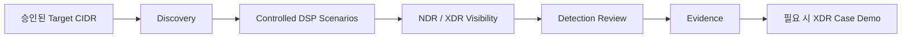

# 고객 POC Workflow

DSP는 고객 POC에서 흔한 문제를 해결하기 위해 설계되었습니다. 정상적이거나 폐쇄된 고객 Network에서는 짧은 평가 기간 동안 충분한 Detection이 발생하지 않을 수 있습니다.

목표는 또 하나의 공격 Framework를 만드는 것이 아닙니다. 통제된 Activity를 사용하여 **XDR/NDR Detection과 Investigation 가치를 눈에 보이게 하고 반복 가능하며 보고 가능한 형태로 만드는 것**입니다.

## 권장 POC 흐름

실제 고객 POC에서는 다음 흐름을 권장합니다.

1. 승인된 CIDR, 제외 대상, Test Window를 합의합니다.
2. 내부 Execution Origin이 필요하지 않다면 `local` + `normal`로 시작합니다.
3. DSP를 실행하고 DSP 자체의 Execution Evidence를 확인합니다.
4. 같은 시간대와 Host를 XDR/NDR Console에서 확인합니다.
5. Matching Detection ID, Screenshot, Note를 기록합니다.
6. XDR Platform이 관련 Signal을 Correlation한다면 Case Timeline을 고객 Evidence에 포함합니다.

<Note>
`dsp run`은 Target Expansion, Discovery/Prefetch, Scenario Ordering, Execution, Event Store 기록, Validation, Reporting, Evidence Generation을 하나의 Operational Flow로 수행합니다. 위 Diagram은 고객 POC 관점의 흐름이며 각 단계가 별도 CLI 명령이라는 의미는 아닙니다.
</Note>

## Operator가 실제로 결정하는 세 가지

| 결정 | 권장 시작값 |
| --- | --- |
| Activity를 어디서 발생시킬 것인가? | `local` |
| 어떤 Network가 Scope인가? | `--target-net <AUTHORIZED_CIDR>` |
| Target Coverage를 얼마나 넓힐 것인가? | `normal` |

`high`는 더 넓은 Host Coverage가 의도된 경우에만 사용하세요. 대상별 Volume은 `normal`과 같고 더 많은 발견 Target으로 범위만 확장합니다.

## Webshell Mode가 필요한 경우

POC Activity를 고객 Network **내부**의 명시적으로 승인된 Test Host에서 발생시켜야 한다면 검증된 JSP/PHP Webshell Provider를 사용할 수 있습니다. Internal Scan, DNS, Web, Identity Service, Protocol, Host Behavior Activity를 외부 DSP Host보다 실제 환경에 가까운 위치에서 생성할 수 있습니다.

현재 Release에서 ASPX/Windows IIS는 Preview 상태입니다.

## 세 종류의 Evidence를 분리해서 보기

| 계층 | 질문 | Evidence |
| --- | --- | --- |
| DSP Execution | DSP가 의도한 Activity를 생성했는가? | `traffic_summary.json`, Event Store, `report.md` |
| Detection | XDR/NDR에서 해당 Activity가 탐지 또는 관찰되었는가? | Detection/Alert ID, Timestamp, Host |
| Investigation | 관련 Signal이 의미 있는 XDR Case/Story로 연결되었는가? | Case ID, Timeline, Screenshot, Analyst Note |

이 세 계층을 분리하면 DSP 자체가 증명하는 범위를 과장하지 않을 수 있습니다.

<CardGroup cols={2}>
  <Card title="Scenario 범위" icon="radar" href="/ko/scenarios">POC 목적에 맞는 Activity 유형을 선택합니다.</Card>
  <Card title="XDR Correlation Demo" icon="link" href="/ko/third-party-alert-case-demo">NDR Detection과 선택적인 External Alert을 하나의 XDR Investigation Story로 연결합니다.</Card>
  <Card title="Report & Evidence" icon="file-lines" href="/ko/reports-and-evidence">DSP Run부터 고객 Proof까지 검증 가능한 Evidence Chain을 만듭니다.</Card>
  <Card title="Safety & Guardrails" icon="shield" href="/ko/safety-and-guardrails">실행 전에 Scope, Host Cap, Execution Origin을 확인합니다.</Card>
</CardGroup>
