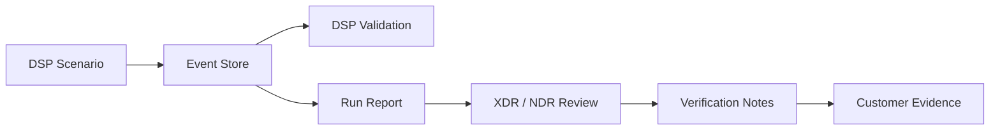

# Report & Evidence

각 DSP Run은 다음 위치에 전용 디렉터리를 생성합니다.

```text
~/.dsp/runs/<run_id>/
```

이 Run Directory는 **DSP가 무엇을 생성했는지**와 **XDR/NDR Platform이 무엇을 탐지했는지**를 연결하는 기준점입니다.

## 처음에는 이 세 파일만 확인

일반적인 POC에서는 아래 세 개를 먼저 보면 충분합니다.

| Artifact | 용도 |
| --- | --- |
| `traffic_summary.json` | Scenario Activity와 Counter 확인 |
| `report.md` | 사람이 읽기 쉬운 Run Summary |
| `verification_checklist.md` | 보안 Platform에서 확인한 Detection/Case Evidence 기록 |

Operator Menu의 **Show latest report**가 최근 Run을 가장 빠르게 확인하는 방법입니다.

## 전체 Artifact

| Artifact | 용도 |
| --- | --- |
| `events.db` | SQLite Append-only Event Store, Run별 Source of Truth |
| `events.jsonl` | Portable Event Export 및 Remote Webshell Collection 형식 |
| `traffic_summary.json` | Scenario별 Activity Counter |
| `validation.json` | DSP Execution/Event Validation 결과 |
| `report.md` | 사람이 읽기 쉬운 Run Report |
| `report.json` | 생성되는 경우 Machine-readable Report Data |
| `verification_checklist.md` | XDR/NDR 결과 기록 Template |
| `investigation_notes.md` | Analyst/고객 POC Note Template |
| `evidence_summary_template.md` | 고객용 Evidence Summary Template |

## Evidence 흐름



Webshell Run에서는 Remote Host가 `events.jsonl` Bundle을 생성합니다. DSP가 이를 가져와 Local Event Store에 Import한 뒤 동일한 Validation/Report/Evidence Pipeline을 계속 수행합니다.

## `validation.json`의 의미

`validation.json`은 DSP의 **자체 Execution 및 Event 기대값**을 확인합니다. XDR/NDR Alert Verdict가 아닙니다.

<Note>
Scenario는 정상적으로 생성되었지만 보안 제품에서 Alert이 발생하지 않을 수 있습니다. DSP Execution Evidence와 Product-side Detection Evidence를 항상 별도 계층으로 관리하세요.
</Note>

## 권장 고객 Evidence Chain

중요한 POC 결과마다 다음 관계를 보존하는 것을 권장합니다.

```text
DSP Run ID
  → Scenario + DSP Activity Evidence
  → XDR/NDR Alert 또는 Detection ID
  → 필요한 경우 XDR Case ID
  → Screenshot/Export + Analyst Conclusion
```

이 구조를 사용하면 최종 Report를 검증 가능하게 만들고, Activity Generation과 Detection Success를 혼동하지 않을 수 있습니다.

## Report 재생성

Run Artifact가 남아 있다면 다음으로 Report를 다시 생성할 수 있습니다.

```bash
dsp report --run-id <run_id>
```
