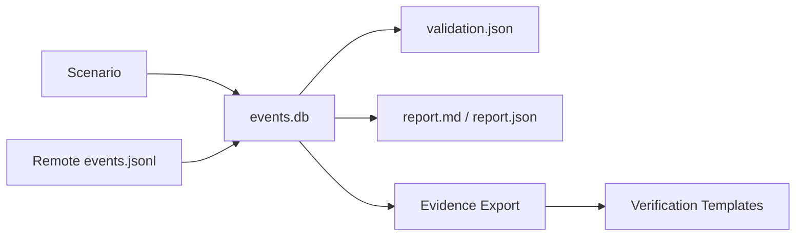

# Report 및 Evidence

각 DSP Run은 다음 위치에 전용 디렉터리를 생성합니다.

```text
~/.dsp/runs/<run_id>/
```

이 Run Directory는 **DSP가 실제로 생성한 Activity**와 **보안 플랫폼이 Detection한 결과**를 연결하는 기준점입니다.

## 주요 Artifact

| Artifact | 용도 |
| --- | --- |
| `events.db` | SQLite Append-only Event Store 및 Run별 Source of Truth |
| `events.jsonl` | 이동 가능한 Event Export, Remote Webshell Collection에도 사용 |
| `traffic_summary.json` | Scenario별 Activity Counter |
| `validation.json` | DSP Execution/Event Validation 결과 |
| `report.md` | 사람이 읽을 수 있는 Run Report |
| `report.json` | 생성되는 경우 Machine-readable Report Data |
| `verification_checklist.md` | 보안 플랫폼 결과를 수동으로 확인하기 위한 Template |
| `investigation_notes.md` | Analyst/Customer POC Note Template |
| `evidence_summary_template.md` | 외부 Evidence를 요약하기 위한 Template |

## Event Store

DSP는 Run별 Append-only Event Store를 사용합니다. Scenario Execution은 구조화된 Event를 기록하고 Reporting/Validation/Evidence Layer는 각자 Activity를 추측하지 않고 해당 Store를 읽습니다.

Webshell Run에서는 Remote Host가 `events.jsonl` Bundle을 생성합니다. DSP는 이 Bundle을 Download하고 Run Metadata를 확인한 뒤 Local Event Store에 Import하고 표준 Validation 및 Reporting Flow를 수행합니다.



## Traffic Summary

`traffic_summary.json`에는 전송한 Query 수, 시도한 Probe 수, 생성한 Request 수 등 Scenario별 Activity Counter가 기록됩니다. Operator Menu에서 **Show latest report**를 선택하면 이 파일을 확인할 수 있습니다.

Traffic Summary를 통해 다음을 확인합니다.

- 예상한 Scenario가 실제로 실행되었는가?
- 얼마나 많은 Activity가 생성되었는가?
- 보안 제품에서 어떤 Scenario를 기준으로 검색해야 하는가?

## Validation Result

`validation.json`은 DSP 자체의 Execution/Event Expectation을 확인합니다. 이를 XDR/NDR Alert 결과로 해석해서는 안 됩니다.

<Note>
DSP는 Execution Validation과 Detection Validation을 의도적으로 분리합니다. Scenario가 정상적으로 생성되어도 보안 제품에서 Alert이 발생하지 않을 수 있으며, 발생한 Alert도 의미 있는 POC Evidence인지 사람의 해석이 필요할 수 있습니다.
</Note>

## Manual Verification Package

DSP는 POC의 사람이 수행하는 검증을 지원하기 위해 다음 Template을 생성합니다.

```text
verification_checklist.md
investigation_notes.md
evidence_summary_template.md
```

여기에 Alert ID, Case ID, Screenshot, Detection Name, Timestamp, Analyst Conclusion 및 고객별 Note를 기록할 수 있습니다.

## Report 재생성

Run Artifact가 남아 있다면 다음 명령으로 Report를 다시 생성할 수 있습니다.

```bash
dsp report --run-id <run_id>
```

## 권장 POC Evidence Chain

검증 가능한 고객 Report는 다음 연결 관계를 유지하는 것이 좋습니다.

```text
DSP Run ID
  → DSP Scenario/Event Evidence
  → Security-platform Alert/Detection ID
  → Correlated XDR Case ID (해당되는 경우)
  → Screenshot/Export + Analyst Conclusion
```

이를 통해 어떤 내용이 DSP에 의해 증명되고 어떤 내용이 연결된 보안 플랫폼에 의해 증명되는지 명확히 구분할 수 있습니다.
