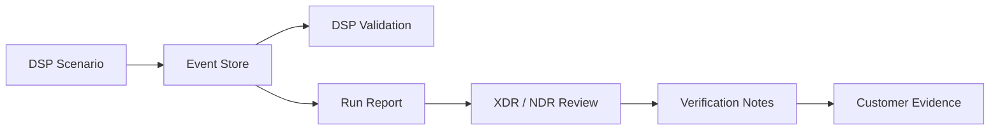

# 보고서 및 검증 자료

각 DSP 실행은 다음 위치에 전용 디렉터리를 생성합니다.

```text
~/.dsp/runs/<run_id>/
```

이 실행 디렉터리는 **DSP가 무엇을 생성했는지**와 **XDR/NDR 플랫폼이 무엇을 탐지했는지**를 함께 확인하는 기준점입니다.

## 처음에는 이 세 파일만 확인

일반적인 POC에서는 아래 세 개를 먼저 보면 충분합니다.

| Artifact | 용도 |
| --- | --- |
| `traffic_summary.json` | Scenario Activity와 Counter 확인 |
| `report.md` | 사람이 읽기 쉬운 실행 요약 |
| `verification_checklist.md` | 보안 플랫폼에서 확인한 Detection/Case 결과 기록 |

Operator Menu의 **Show latest report**가 최근 Run을 가장 빠르게 확인하는 방법입니다.

## 전체 Artifact

| Artifact | 용도 |
| --- | --- |
| `events.db` | SQLite Append-only Event Store, Run별 Source of Truth |
| `events.jsonl` | 이벤트 내보내기 및 원격 Webshell 수집 형식 |
| `traffic_summary.json` | 시나리오별 활동 수 |
| `validation.json` | DSP Execution/Event Validation 결과 |
| `report.md` | 사람이 읽기 쉬운 실행 보고서 |
| `report.json` | 생성되는 경우 기계가 읽을 수 있는 보고서 데이터 |
| `verification_checklist.md` | XDR/NDR 결과 기록 Template |
| `investigation_notes.md` | Analyst/고객 POC Note Template |
| `evidence_summary_template.md` | 고객용 검증 요약 템플릿 |

## Evidence 흐름


```mermaid
flowchart LR
  S[DSP Scenario] --> E[Event Store]
  E --> V[DSP Validation]
  E --> R[Run Report]
  R --> P[XDR / NDR Review]
  P --> M[Verification Notes]
  M --> C[Customer Evidence]
```

Webshell 실행에서는 원격 호스트가 `events.jsonl` 번들을 생성합니다. DSP는 이 파일을 가져와 로컬 Event Store에 넣고 같은 검증 및 보고 절차를 계속 수행합니다.

## `validation.json`의 의미

`validation.json`은 DSP가 **자체 실행과 이벤트 기대값**을 충족했는지 확인합니다. XDR/NDR Alert 결과를 판정하는 파일이 아닙니다.

<Note>
Scenario는 정상적으로 생성되었지만 보안 제품에서 Alert이 발생하지 않을 수 있습니다. DSP 실행 기록과 보안 제품의 탐지 결과는 항상 구분해서 관리하세요.
</Note>

## 권장 고객 검증 기록

중요한 POC 결과마다 다음 관계를 보존하는 것을 권장합니다.

```text
DSP Run ID
  → Scenario + DSP Activity Evidence
  → XDR/NDR Alert 또는 Detection ID
  → 필요한 경우 XDR Case ID
  → Screenshot/Export + Analyst Conclusion
```

이 구조를 사용하면 최종 보고서를 다시 확인할 수 있고, 활동 생성 성공과 보안 제품의 탐지 성공을 혼동하지 않을 수 있습니다.

## Report 재생성

실행 기록이 남아 있다면 다음 명령으로 보고서를 다시 생성할 수 있습니다.

```bash
dsp report --run-id <run_id>
```
