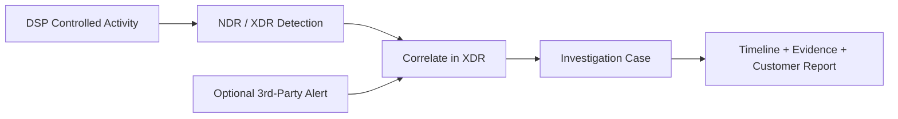

# XDR Correlation Demo

좋은 XDR POC는 Traffic을 생성하는 것으로 끝나지 않습니다. **DSP가 무엇을 생성했는지**, **NDR/XDR에서 무엇을 탐지했는지**, **Analyst가 무엇을 Investigation할 수 있는지**가 하나의 Story로 연결되어야 합니다.

3rd-Party Alert은 선택적인 Context입니다. DSP 자체가 해당 Alert을 Ingest하거나 만들어내는 것은 아닙니다.

## 권장 Demo Pattern



## DSP의 역할

DSP는 **관찰 가능한 Activity와 Execution Evidence**를 생성합니다. Network, DNS, Web, Identity Service, Protocol, 통제된 Host-side Behavior를 생성하고 자신이 수행한 내용을 Run ID 아래에 기록합니다.

Detection, Alert, Correlation, Severity, Case 생성은 XDR/NDR Platform의 역할입니다.

<Warning>
DSP PASS는 특정 Alert이나 XDR Case가 존재한다는 것을 증명하지 않습니다. Detection과 Correlation은 반드시 보안 Platform에서 직접 확인하고 Product-side Evidence를 별도로 기록해야 합니다.
</Warning>

## 실제 Demo Workflow

1. 승인된 Scope에서 DSP를 실행합니다.
2. `traffic_summary.json`과 `report.md`에서 의도한 Activity가 생성되었는지 확인합니다.
3. 동일한 시간대와 Host를 기준으로 Matching NDR/XDR Detection을 찾습니다.
4. POC에 External/3rd-Party Alert이 포함된다면 XDR에 해당 Alert이 존재하는지 확인합니다.
5. Platform이 관련 Signal을 하나의 Case로 Correlation하는지 확인합니다.
6. Detection ID, Case ID, Timestamp, Host, Screenshot, Analyst Conclusion을 수집합니다.

## Evidence Checklist

Demo에 사용하는 각 Signal에 대해 다음을 기록합니다.

- DSP Run ID 및 Scenario ID
- Scenario Start/End Time
- Source/Destination Host
- XDR/NDR Alert 또는 Detection ID
- 선택적인 3rd-Party Alert ID와 Source
- 생성된 경우 XDR Case ID
- Screenshot 또는 Export된 Evidence
- Signal 관계를 설명하는 Analyst Note

최종 Report에서는 다음 경계를 유지하는 것이 좋습니다.

```text
DSP Evidence = Activity가 생성되었음을 증명
XDR/NDR Evidence = Activity가 탐지 또는 관찰되었음을 증명
XDR Case Evidence = 관련 Signal이 Correlation/Investigation되었음을 증명
```

<Card title="Evidence Chain 구성" icon="file-lines" href="/ko/reports-and-evidence">
  DSP Run Artifact와 Product-side ID/Screenshot을 연결해 검증 가능한 POC 기록을 만듭니다.
</Card>
