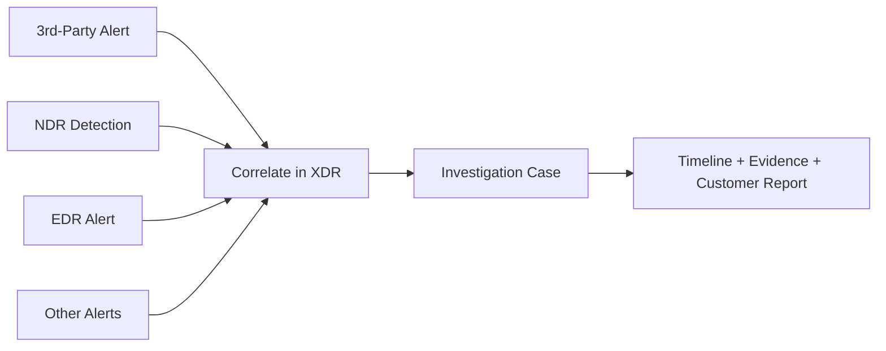

# 3rd-Party Alert & Case Demo

좋은 고객 POC는 단순히 Traffic을 발생시키는 데서 끝나지 않습니다. 서로 다른 보안 Signal이 하나의 일관된 Investigation Story로 연결되는 모습을 보여주는 것이 중요합니다.

Demo Pattern은 다음과 같습니다.

## 예시 Signal Story

| Source | POC Evidence 예시 |
| --- | --- |
| 3rd-party alert | XDR에 Ingest된 Webshell Detection 또는 기타 External Source Event |
| NDR | Lateral Movement 형태 Activity, Port Scan, DNS Tunnel, Web Scanning 또는 Protocol Anomaly |
| EDR | `host_behavior_check` 또는 승인된 Endpoint Test Activity에서 생성된 통제된 Endpoint Behavior |
| XDR case | 관련 Alert, Timeline, Severity/Status 및 Source Context가 포함된 하나의 Investigation |

목표는 여러 보안 Data Source를 개별 Alert로 보는 것이 아니라 하나의 Investigation 흐름에서 함께 분석할 수 있음을 고객에게 보여주는 것입니다.

## DSP의 역할

DSP는 **관찰 가능한 Activity와 Execution Evidence를 생성**합니다. 예를 들어 Webshell Host에서 Internal Traffic을 발생시키고, Network/DNS/Web/Identity Activity와 통제된 Host-side Behavior를 생성할 수 있습니다.

DSP는 자신이 생성한 Activity를 Event Store에 기록하고, 보안 플랫폼에서 확인한 Alert과 비교할 수 있는 Run Artifact를 생성합니다.

## DSP가 자동으로 하지 않는 것

<Warning>
DSP는 3rd-Party Alert, NDR Detection, EDR Alert 또는 Correlated XDR Case가 실제로 존재한다고 자동으로 증명하거나 선언하지 않습니다. Source Platform에서 해당 Signal을 실제로 생성하거나 Ingest해야 하며, POC Engineer가 Detection과 Case Correlation 결과를 검증해야 합니다.
</Warning>

실제 POC Workflow는 다음과 같습니다.

1. 승인된 고객 Test Scope에서 DSP를 실행합니다.
2. `traffic_summary.json`, `events.db`, DSP Report에서 예상 Activity가 생성되었는지 확인합니다.
3. XDR/NDR UI에서 동일한 시간대와 Host에 해당하는 Detection을 확인합니다.
4. Demo에 사용할 3rd-Party Alert을 Ingest하거나 식별합니다.
5. 보안 플랫폼이 관련 Signal을 Case로 Correlation하는지 확인하고, 필요하면 POC 목적에 맞게 지원되는 Correlation Workflow를 구성합니다.
6. Screenshot, Alert ID, Timestamp, 관련 Host 및 Case Timeline을 수집합니다.
7. DSP의 Verification 및 Investigation Note Template에 결과를 기록합니다.

## 권장 고객 Demo Narrative

### 1. 최초 External Signal

Webshell 관련 Source Event와 같은 External/3rd-Party Alert이 XDR Platform으로 들어오는 모습을 보여줍니다.

### 2. 내부 Activity

필요한 경우 DSP Webshell Mode를 사용하여 승인된 Host에서 Internal Reconnaissance 및 Service-oriented Activity를 발생시킵니다.

### 3. Network Detection

DSP가 생성한 Scan, DNS, Web, Identity 또는 Unusual Protocol Activity가 NDR에서 어떻게 보이는지 보여줍니다.

### 4. Endpoint Signal

통제된 Host Behavior에 대한 승인된 Endpoint Telemetry 또는 Alert을 보여줍니다.

### 5. Correlated Investigation

XDR Platform의 Correlation Rule과 Data가 충분한 경우 관련 Source가 하나의 Investigation View에 연결되는 모습을 보여줍니다.

### 6. Evidence Package

DSP Artifact와 보안 플랫폼의 Screenshot/ID를 함께 사용하여 고객용 POC Report를 작성합니다.

## Evidence Checklist

Demo에 사용하는 각 Alert 또는 Case에 대해 다음 항목을 기록합니다.

- DSP Run ID
- Scenario ID
- Source 및 Destination Host
- Scenario Start/End Time
- 보안 제품 Alert/Detection ID
- Alert Source (`3rd-party`, `NDR`, `EDR` 등)
- Case가 생성된 경우 XDR Case ID
- Screenshot 또는 Export된 Evidence
- Signal 간 관계를 설명하는 Analyst Note

이렇게 DSP Evidence와 보안 플랫폼 Evidence를 분리하면 최종 POC Report를 검증 가능하게 만들 수 있습니다. **DSP Evidence는 생성된 Activity를 증명하고, 보안 플랫폼 Evidence는 Detection/Correlation을 증명합니다.**
