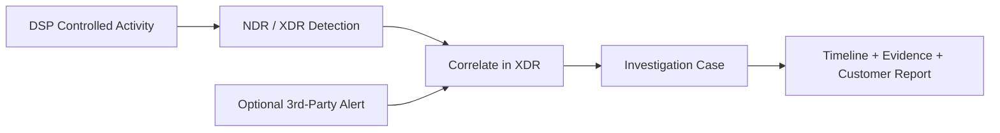

# XDR Correlation Demo

좋은 XDR POC는 트래픽을 생성하는 것으로 끝나지 않습니다. **DSP가 무엇을 생성했는지**, **NDR/XDR에서 무엇을 탐지했는지**, **분석가가 무엇을 조사할 수 있는지**가 하나의 흐름으로 이어져야 합니다.

외부 Alert은 선택적인 참고 정보입니다. DSP 자체가 해당 Alert을 수집하거나 만들어내는 것은 아닙니다.

## 권장 Demo Pattern



## DSP의 역할

DSP는 **관찰 가능한 활동과 실행 기록**를 생성합니다. 네트워크, DNS, 웹, Identity Service, 프로토콜, 통제된 호스트 동작를 생성하고 자신이 수행한 내용을 실행 ID 아래에 기록합니다.

탐지, Alert, 상관분석, Severity, Case 생성은 XDR/NDR 플랫폼의 역할입니다.

<Warning>
DSP PASS는 특정 Alert이나 XDR Case가 존재한다는 것을 증명하지 않습니다. 탐지와 상관분석은 반드시 보안 플랫폼에서 직접 확인하고 제품 측 결과를 별도로 기록해야 합니다.
</Warning>

## 실제 데모 진행 순서

1. 승인된 Scope에서 DSP를 실행합니다.
2. `traffic_summary.json`과 `report.md`에서 의도한 활동이 생성되었는지 확인합니다.
3. 동일한 시간대와 호스트를 기준으로 대응되는 NDR/XDR 탐지을 찾습니다.
4. POC에 외부 Alert이 포함된다면 XDR에 해당 Alert이 존재하는지 확인합니다.
5. 플랫폼이 관련 Signal을 하나의 Case로 연결하는지 확인합니다.
6. Detection ID, Case ID, Timestamp, Host, Screenshot, Analyst Conclusion을 수집합니다.

## Evidence Checklist

Demo에 사용하는 각 Signal에 대해 다음을 기록합니다.

- DSP 실행 ID 및 Scenario ID
- Scenario Start/End Time
- Source/Destination Host
- XDR/NDR Alert 또는 Detection ID
- 선택적인 3rd-Party Alert ID와 Source
- 생성된 경우 XDR Case ID
- 화면 캡처 또는 내보낸 검증 자료
- Signal 관계를 설명하는 Analyst Note

최종 Report에서는 다음 경계를 유지하는 것이 좋습니다.

```text
DSP Evidence = Activity가 생성되었음을 증명
XDR/NDR Evidence = Activity가 탐지 또는 관찰되었음을 증명
XDR Case Evidence = 관련 Signal이 Correlation/Investigation되었음을 증명
```

<Card title="검증 기록 구성" icon="file-lines" href="/ko/reports-and-evidence">
  DSP Run Artifact와 Product-side ID/Screenshot을 연결해 검증 가능한 POC 기록을 만듭니다.
</Card>
