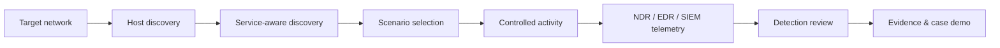

# Customer POC Program

DSP is designed for a common customer-POC problem: the environment may be secure, isolated, or simply too quiet to produce enough meaningful alerts and cases during the evaluation window.

## The POC problem

<CardGroup cols={2}>
  <Card title="Limited proof in clean networks" icon="shield">
    A healthy customer network may generate too few meaningful security events to demonstrate detection and investigation value.
  </Card>
  <Card title="Customer reporting pressure" icon="file-chart-column">
    Security teams often need screenshots, timelines, evidence, and cases they can show internally after the POC.
  </Card>
  <Card title="Red-team-like requests" icon="crosshairs">
    Customers may ask for controlled activity that produces observable detections without introducing destructive tooling.
  </Card>
  <Card title="Generic BAS mismatch" icon="puzzle-piece">
    Generic attack-execution tools do not always map cleanly to the detections and workflows being demonstrated in a specific XDR POC.
  </Card>
</CardGroup>

The goal is not to create another attack framework. The goal is to make **XDR value visible, repeatable, and reportable**.

## Conceptual POC flow

The customer-facing program can be explained as seven stages:

1. Define the authorized target network.
2. Identify reachable hosts.
3. Discover relevant network services through DSP's runtime/scenario flow.
4. Select scenarios automatically from the operational profile or explicitly for advanced testing.
5. Generate service-specific, observable activity.
6. Review resulting NDR/EDR/SIEM detections in the security platform.
7. Capture evidence and, where applicable, show the alerts as part of an XDR investigation case.

<Note>
The seven-stage diagram is the **POC workflow model**. The current implementation does not expose each stage as a separate user command. `dsp run` performs target expansion, discovery/prefetch, scenario ordering, execution, Event Store recording, validation, reporting, and evidence generation as one operational flow.
</Note>

## How engineers use DSP

For a standard customer POC, the engineer typically makes only three decisions:

| Decision | Options |
| --- | --- |
| Where does activity originate? | `local` or `webshell` |
| Which network is in scope? | `--target-net <CIDR>` |
| How broad is target coverage? | `normal` or `high` |

The current v1.4.0 runtime treats `normal` and `high` as **coverage profiles**. Both use the same per-target volume; `high` expands activity to more discovered targets.

## When webshell mode helps

A webshell provider is useful when the POC needs activity to originate **inside** the customer network from an already authorized lab/test host. This can make internal scans, service discovery, DNS activity, web requests, identity-service failures, and endpoint behavior more representative of the customer environment.

Validated remote providers are JSP and PHP. ASPX remains preview until real Windows IIS validation is completed.

## POC success criteria

A strong POC result should separate three questions:

| Layer | Question | Evidence |
| --- | --- | --- |
| DSP execution | Did DSP actually generate the intended activity? | Event Store, traffic summary, run report |
| Detection | Did the security product detect the activity? | Alert/detection in NDR, EDR, SIEM, or XDR UI |
| Investigation | Did related signals become a useful case/story? | Correlated case, timeline, screenshots, analyst notes |

Keeping these layers separate avoids overstating what DSP itself proves.

<Card title="Build a 3rd-party alert and case demo" icon="link" href="/third-party-alert-case-demo">
  See how generated activity can support a demo involving external alerts, NDR detections, EDR alerts, and a single investigation case.
</Card>
