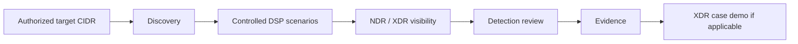

# Customer POC Workflow

DSP is designed for a common evaluation problem: a healthy or isolated customer network may be too quiet to produce enough useful detections during a short POC window.

The goal is not to build another attack framework. The goal is to make **XDR/NDR detection and investigation value visible, repeatable, and reportable** using controlled activity.

## Recommended POC flow

A practical customer workflow is:

1. Agree on the authorized CIDR, exclusions, and test window.
2. Start with `local` + `normal` unless an internal execution origin is required.
3. Run DSP and confirm its own execution evidence.
4. Review the same time window and hosts in the XDR/NDR console.
5. Record matching detection IDs, screenshots, and notes.
6. If the XDR platform correlates related signals, include the case timeline as customer evidence.

<Note>
`dsp run` performs target expansion, discovery/prefetch, scenario ordering, execution, Event Store recording, validation, reporting, and evidence generation as one operational flow. The diagram above is the customer POC model, not a list of separate CLI commands.
</Note>

## The three decisions most operators make

| Decision | Recommended starting point |
| --- | --- |
| Where should activity originate? | `local` |
| What network is in scope? | `--target-net <AUTHORIZED_CIDR>` |
| How broad should coverage be? | `normal` |

Use `high` only when broader host coverage is intentional. It keeps the same per-target volume as `normal` and expands coverage across more discovered targets.

## When webshell mode is useful

Use a validated JSP/PHP webshell provider when the POC needs activity to originate **inside** the customer network from an explicitly authorized test host. This is useful for internal scanning, DNS, web, identity-service, protocol, and host-behavior scenarios that would not be representative from the external DSP host.

ASPX/Windows IIS remains preview in the current release.

## Separate three kinds of evidence

| Layer | Question | Evidence |
| --- | --- | --- |
| DSP execution | Did DSP generate the intended activity? | `traffic_summary.json`, Event Store, `report.md` |
| Detection | Did XDR/NDR detect or expose the activity? | Detection/alert ID, timestamp, affected hosts |
| Investigation | Did the signals become a useful XDR case/story? | Case ID, timeline, screenshots, analyst notes |

Keeping these layers separate prevents the POC report from overstating what DSP itself proves.

<CardGroup cols={2}>
  <Card title="Scenario coverage" icon="radar" href="/scenarios">Choose the activity types that best fit the POC objective.</Card>
  <Card title="XDR correlation demo" icon="link" href="/xdr-correlation-demo">Use NDR detections and optional external alerts in one XDR investigation story.</Card>
  <Card title="Reports & evidence" icon="file-lines" href="/reports-and-evidence">Build an auditable chain from DSP run to customer proof.</Card>
  <Card title="Safety & guardrails" icon="shield" href="/safety-and-guardrails">Confirm scope, host caps, and execution origin before running.</Card>
</CardGroup>
