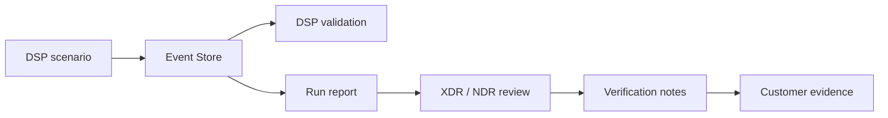

# Reports & Evidence

Every DSP run creates a dedicated directory under:

```text
~/.dsp/runs/<run_id>/
```

The run directory is the bridge between **what DSP generated** and **what the XDR/NDR platform detected**.

## Start with these three files

For normal POC work, check these first:

| Artifact | Purpose |
| --- | --- |
| `traffic_summary.json` | Confirms scenario activity and counters |
| `report.md` | Human-readable run summary |
| `verification_checklist.md` | Records matching detection/case evidence from the security platform |

The operator menu's **Show latest report** option gives the quickest view of the most recent run.

## Full artifact set

| Artifact | Purpose |
| --- | --- |
| `events.db` | SQLite append-only Event Store and per-run source of truth |
| `events.jsonl` | Portable event export; also used by remote webshell collection |
| `traffic_summary.json` | Scenario-level activity counters |
| `validation.json` | DSP execution/event validation result |
| `report.md` | Human-readable run report |
| `report.json` | Machine-readable report data when generated |
| `verification_checklist.md` | Template for recording XDR/NDR outcomes |
| `investigation_notes.md` | Analyst/customer POC notes template |
| `evidence_summary_template.md` | Template for customer-facing evidence |

## Evidence flow



For webshell runs, the remote host produces an `events.jsonl` bundle. DSP retrieves it, imports the events into the local Event Store, and continues through the same validation/report/evidence pipeline.

## What `validation.json` means

`validation.json` confirms DSP's **own execution and event expectations**. It is not an XDR/NDR alert verdict.

<Note>
A scenario can be generated successfully even if the security product does not alert. Treat DSP execution evidence and product-side detection evidence as separate layers.
</Note>

## Recommended customer evidence chain

Preserve this relationship for each important POC finding:

```text
DSP Run ID
  → scenario + DSP activity evidence
  → XDR/NDR alert or detection ID
  → XDR case ID, if applicable
  → screenshot/export + analyst conclusion
```

This makes the final report auditable and prevents generated activity from being confused with detection success.

## Regenerate a report

If the run artifacts still exist:

```bash
dsp report --run-id <run_id>
```
