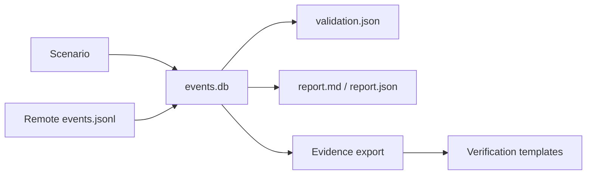

# Reports & Evidence

Every DSP run creates a dedicated directory under:

```text
~/.dsp/runs/<run_id>/
```

The run directory is the bridge between **what DSP generated** and **what the security platform detected**.

## Core artifacts

| Artifact | Purpose |
| --- | --- |
| `events.db` | SQLite append-only Event Store and per-run source of truth |
| `events.jsonl` | Portable event export; also used by remote webshell collection |
| `traffic_summary.json` | Scenario-level activity counters |
| `validation.json` | DSP execution/event validation result |
| `report.md` | Human-readable run report |
| `report.json` | Machine-readable report data when generated |
| `verification_checklist.md` | Template for manually checking security-platform outcomes |
| `investigation_notes.md` | Analyst/customer POC notes template |
| `evidence_summary_template.md` | Template for summarizing external proof |

## Event Store

DSP uses a per-run append-only Event Store. Scenario execution writes structured events, and the reporting/validation/evidence layers read from that store instead of independently inferring activity.

For webshell runs, the remote host produces an `events.jsonl` bundle. DSP downloads the bundle, verifies the run metadata, imports the events into the local Event Store, and then runs the standard validation and reporting flow.



## Traffic summary

`traffic_summary.json` records counters such as queries sent, probes attempted, requests generated, or other scenario-specific activity. The operator menu displays this file when you choose **Show latest report**.

Use the traffic summary to answer:

- Did the expected scenario actually execute?
- How much activity was generated?
- Which scenario should be searched for in the security product?

## Validation result

`validation.json` confirms DSP's own execution/event expectations. It should not be interpreted as an NDR/EDR/SIEM alert verdict.

<Note>
DSP intentionally separates execution validation from detection validation. A scenario may be successfully generated even when the security product does not alert, and an alert may need human interpretation before it is considered useful POC evidence.
</Note>

## Manual verification package

DSP generates templates that support the human side of the POC:

```text
verification_checklist.md
investigation_notes.md
evidence_summary_template.md
```

Use these to record alert IDs, case IDs, screenshots, detection names, timestamps, analyst conclusions, and customer-specific notes.

## Regenerate a report

If the run artifacts still exist:

```bash
dsp report --run-id <run_id>
```

## Recommended POC evidence chain

A defensible customer report should preserve this chain:

```text
DSP Run ID
  → DSP scenario/event evidence
  → security-platform alert/detection ID
  → correlated XDR case ID (if applicable)
  → screenshot/export + analyst conclusion
```

This makes it clear which statements are proven by DSP and which are proven by the connected security platform.
