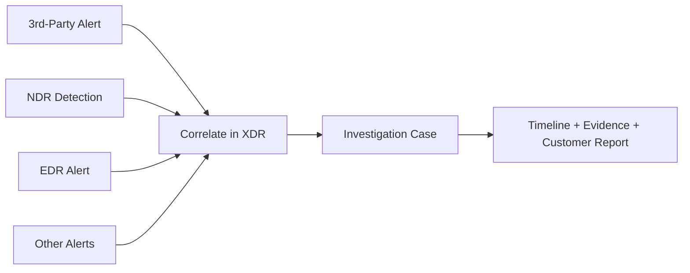

# 3rd-Party Alert & Case Demo

A useful customer POC is not only about producing traffic. It is about showing how different security signals can become a coherent investigation story.

The demo pattern is:

## Example signal story

| Source | Example POC evidence |
| --- | --- |
| 3rd-party alert | Webshell detection or another external source event ingested into XDR |
| NDR | Lateral-movement-style activity, port scan, DNS tunnel, web scanning, or protocol anomaly |
| EDR | Controlled endpoint behavior from `host_behavior_check` or other approved endpoint test activity |
| XDR case | One investigation containing related alerts, timeline, severity/status, and source context |

The objective is to help the customer demonstrate that multiple security data sources can be investigated together rather than as isolated alerts.

## DSP's role

DSP is responsible for **generating observable activity and execution evidence**. For example, it can originate internal traffic from a webshell host, create network/DNS/web/identity activity, and create controlled host-side behavior.

DSP then records what it generated in the Event Store and creates run artifacts that can be compared with the alerts seen in the security platform.

## What DSP does not do automatically

<Warning>
DSP does not automatically prove or assert that a 3rd-party alert, NDR detection, EDR alert, or correlated XDR case exists. The source platform must actually generate/ingest those signals, and the POC engineer must verify the resulting detections and case correlation.
</Warning>

In practice, the POC workflow is:

1. Run DSP in an authorized customer test scope.
2. Confirm the expected activity in `traffic_summary.json`, `events.db`, and the DSP report.
3. Open the XDR/NDR/EDR/SIEM UI and find the detections corresponding to the same time window and hosts.
4. Ingest or identify the 3rd-party alert that will participate in the demonstration.
5. Verify whether the security platform correlates related signals into a case, or create/configure the supported correlation workflow as appropriate for the POC.
6. Capture screenshots, alert IDs, timestamps, affected hosts, and the resulting case timeline.
7. Record those findings in DSP's verification and investigation-note templates.

## Suggested customer demo narrative

### 1. Initial external signal

Show an external/3rd-party alert, such as a webshell-related source event, entering the XDR platform.

### 2. Internal activity

Use DSP webshell mode, where appropriate, to originate internal reconnaissance and service-oriented activity from an authorized host.

### 3. Network detections

Demonstrate NDR visibility for scan, DNS, web, identity, or unusual-protocol behavior that was generated by DSP.

### 4. Endpoint signal

Demonstrate approved endpoint telemetry/alerting for controlled host behavior.

### 5. Correlated investigation

Show the related sources in a single investigation view when the XDR platform's correlation rules and data are sufficient to do so.

### 6. Evidence package

Use DSP artifacts plus screenshots/IDs from the security platform to create a customer-ready POC report.

## Evidence checklist

For every alert or case used in the demo, capture:

- DSP run ID
- scenario ID
- source and destination hosts
- scenario start/end time
- security product alert/detection ID
- alert source (`3rd-party`, `NDR`, `EDR`, etc.)
- XDR case ID, if a case was created
- screenshot or exported evidence
- analyst note explaining the relationship

This separation makes the final POC report auditable: **DSP evidence proves generated activity; security-platform evidence proves detection/correlation.**
