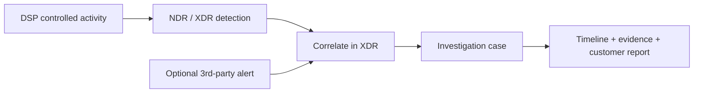

# XDR Correlation Demo

A useful XDR POC should show more than generated traffic. It should connect **what DSP generated**, **what NDR/XDR detected**, and **what the analyst can investigate**.

Third-party alerts are optional context. DSP itself does not ingest or manufacture those alerts.

## Recommended demo pattern



## DSP's role

DSP is responsible for **observable activity and execution evidence**. It can generate network, DNS, web, identity-service, protocol, and controlled host-side behavior, then record what it generated under a run ID.

The XDR/NDR platform is responsible for detection, alerting, correlation, severity, and case creation.

<Warning>
A DSP PASS does not prove that a specific alert or XDR case exists. Always verify detection and correlation in the security platform and record the product-side evidence separately.
</Warning>

## Practical demo workflow

1. Run DSP inside the authorized scope.
2. Confirm the intended activity in `traffic_summary.json` and `report.md`.
3. Find the matching NDR/XDR detection using the same time window and hosts.
4. If the POC includes an external/third-party alert, confirm that it is present in XDR.
5. Verify whether the platform correlates the related signals into a case.
6. Capture the detection IDs, case ID, timestamps, hosts, screenshots, and analyst conclusion.

## Evidence checklist

For each signal used in the demo, capture:

- DSP run ID and scenario ID
- scenario start/end time
- source and destination hosts
- XDR/NDR alert or detection ID
- optional third-party alert ID and source
- XDR case ID, when created
- screenshot or exported evidence
- analyst note explaining the relationship

The final report should preserve a simple boundary:

```text
DSP evidence = activity was generated
XDR/NDR evidence = activity was detected or exposed
XDR case evidence = related signals were correlated/investigated
```

<Card title="Build the evidence chain" icon="file-lines" href="/reports-and-evidence">
  Use DSP run artifacts and product-side IDs/screenshots to create an auditable POC record.
</Card>
